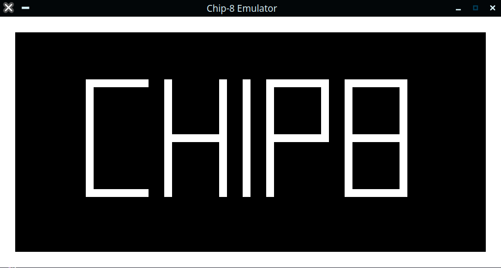
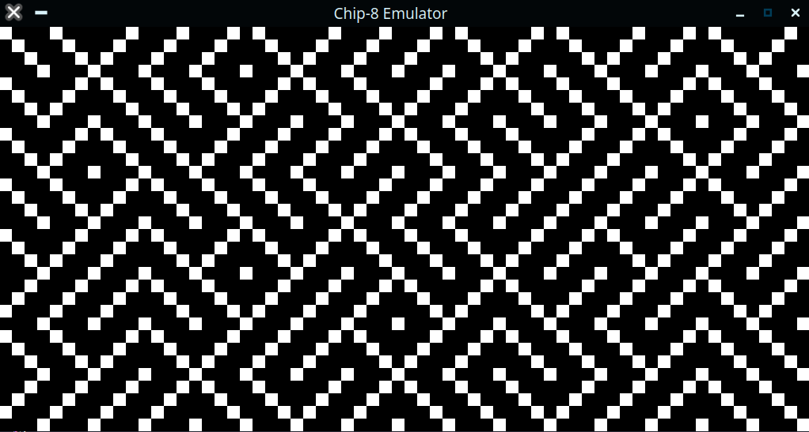
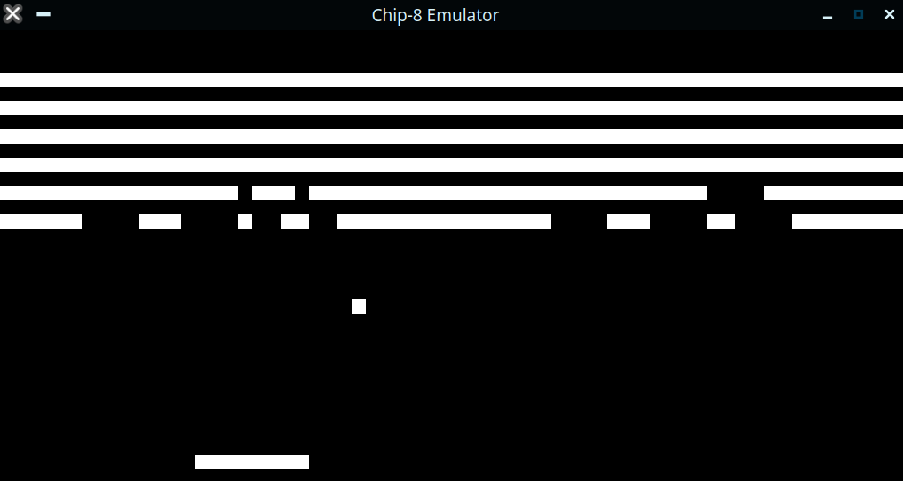

# Chip8 Emulator



My implementation of the classic Chip8 Emulator, written in Rust using the SLD2 crate.

## Usage

In order to build/run this emulator, you'll need `cargo`. Once you have that installed, you can clone the repository, and run the emulator using

```
cargo run -- Path/To/Rom.ch8
```

to decompile a ROM, just pass the `-d` flag:

```
cargo run -- -d Path/To/Rom.ch8
```

Two notes about the dissasembler:

1. The abreviation for each instruction is used according to [Cowgod's chip8 reference](http://devernay.free.fr/hacks/chip8/C8TECH10.HTM), as I couldn't find any other specification for Chip8 instruction naming conventions.
2. The dissasembler can't distinquish between .text and .data segements, so if a particular word of a data segment is a valid instruciton, it will be decoded as such. Invalid instructions (e.g. data) will be emitted as hexadecimal.

I have not currently implemented an assembler.

## Gallery

Maze.ch8 - The classic Random Maze from the old C64 and Apple][ days


Breakout.ch8 (Carmelo Cortez, 1979) - an implementation of the game Breakout


## References

* [Cowgod's chip8 reference](http://devernay.free.fr/hacks/chip8/C8TECH10.HTM) seems to be the de-facto specification for the CHIP-8 nowadays, and is what I followed for this implementation.
* All of the sample ROMS included were found inculded with other people's Chip8 emulator implementations. Some of the ROMS I found had attributions, but it should be pretty easy to find the ones that don't with a quick google search of the filename.